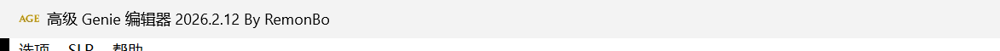
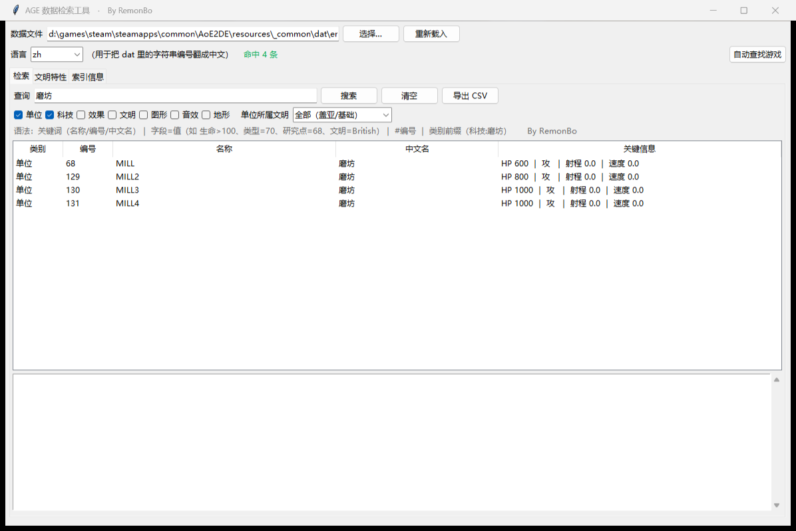
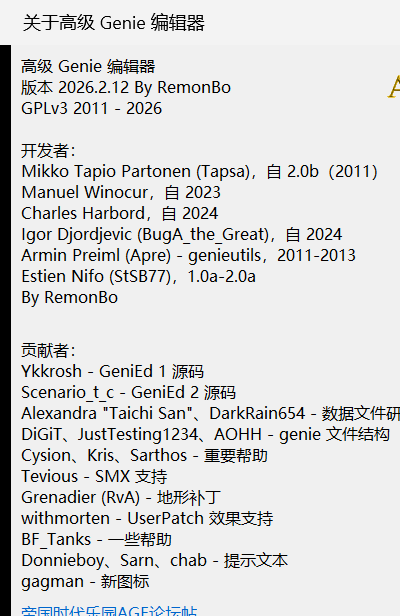
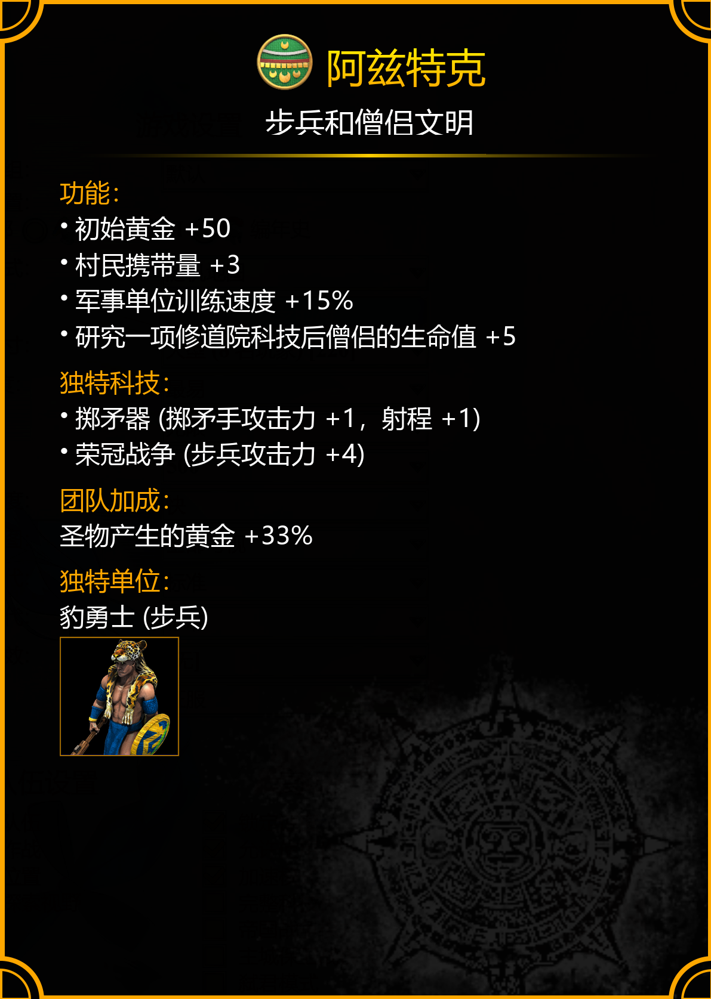

# AGE3 高级 Genie 编辑器 · 简体中文汉化版 + AGE 数据检索工具

> **By RemonBo** · 版本 v1.0（2026-10-04）
> 面向《帝国时代 II：决定版》（AoE2DE）MOD 作者的汉化与速查工具包。

---

## 这个包里有什么

| 内容 | 说明 |
| --- | --- |
| **AGE3 界面汉化** | `AdvancedGenieEditor3.exe`，界面字符串 3119 条中文化（菜单、按钮、字段名、下拉项、提示语），功能与原版完全一致，只改文本；文件大小与程序逻辑未变 |
| **名称表汉化** | `AGE3NamesV0007.ini`：护甲、地形表、文明资源等 569 条名称 |
| **文本语言文件** | `语言文件\AGE3Lang_zh.txt`（36,351 条，GBK）+ `AGE3Lang_en.txt`；合并了官方 13 个字符串表，DLC 单位/科技名（如「英雄祭坛」「罗德岛投石手」）不再乱码 |
| **AGE 数据检索工具** | `数据检索工具\AGE数据检索工具.exe`：离线检索 dat 全数据，自动定位游戏目录 |
| **文明特色速查表** | `官方数据\帝国时代2决定版全文明特色.xlsx`（62 个文明的定位 / 主要功能 / 独特科技 / 独特单位），配套 62 张游戏内文明卡截图（按序号命名） |
| **对照与说明** | `汉化说明.txt`（汉化范围、编码原理、备份与还原）、`汉化对照表.txt`（3116 条「英文 -> 中文」对照，含占用字节数） |

---

## 快速开始

1. 解压整个文件夹（绿色版，不需要安装）；
2. 双击 `AdvancedGenieEditor3.exe` —— 界面已经是中文；
3. 想让**单位/科技/文明列表**也显示中文名，按 `语言文件\说明-怎么用.txt` 做一次：
   「打开 文件...」→ 勾选「语言文件位置」→ 选中 `语言文件\AGE3Lang_zh.txt` → 选 dat → 「打开」。
4. 想查数据（找某个建筑能研究哪些科技、某文明有什么加成、效果命令到底改了什么），
   双击 `数据检索工具\AGE数据检索工具.exe`，首次启动会自动找到游戏的 dat 并建索引（约 10 秒）。

> 游戏目录里的原始 `key-value-strings-utf8.txt` 是 UTF-8，而 AGE3 按系统本地代码页（简体中文 = GBK）读取，
> 所以**不要直接选游戏那份**，否则一定是乱码 —— 这也是官方数据在编辑器里显示乱码的原因。

---

## AGE 数据检索工具能做什么

- **全数据检索**：单位、科技、效果、文明、图形、音效、地形、地形表、科技树；
- **关键词**：中文名 / 英文名 / 内部名 / 编号都能搜，例如 `磨坊`、`68`、`#12`；
- **结构化查询**：`字段=值`，例如 `生命>500`、`类型=70`、`研究点=68`、`文明=British`；
- **反向引用**：`研究点=68` 直接列出磨坊能研究的全部科技；科技详情里能看到它挂在哪、关联哪个效果；
- **文明特性页**：文明加成 / 团队加成 / 独特科技 / 独特单位一览，并附游戏内文明卡原文；
- **效果命令解读**：把 `Type/A/B/C/D` 直译成人话，例如
  `属性修正（乘法） → 单位=步弓手（4），类别=全部（0），属性=训练时间（101），数量=0.8`；
- **跨文明对比**：同一单位在不同文明下的差异（基底 + 差异索引，省内存）；
- **导出 CSV**（UTF-8-SIG，Excel 直接打开）。

用法细节见 `数据检索工具-使用说明.txt`。

---

## 截图

| AGE3「关于」窗口 | 游戏内文明卡示例 |
| --- | --- |
|  |  |

---

## 系统要求

- Windows 10 / 11 64 位；
- 数据检索工具首次建立索引约 10 秒（峰值内存约 1 GB），之后读取缓存约 200–400 MB；
- 索引与配置默认放在程序同目录的 `age_data_search\`，目录不可写时自动改用 `%LOCALAPPDATA%`；
- 不修改、不写入任何游戏数据文件（dat 只读）。

---

## 许可与致谢

- 原程序 **Advanced Genie Editor 3** 作者：Mikko Tapio Partonen (Tapsa) 等，**GPLv3**；
  本汉化版的程序二进制同样以 **GPLv3** 发布，其对应源码放在 `source\AGE3源码与解析库源码.zip`
  （含 AGE3、genieutils、pcrio）与 `source\数据检索工具源码.zip`，许可证全文见根目录 `LICENSE`。
- 本包中的汉化文本、名称表、语言文件、数据检索工具、文明特色表格与图片整理：**By RemonBo**。
- 欢迎分享给朋友，**请保留署名**；转载/二次发布请同样保留 `By RemonBo` 与 GPLv3 许可。
- 只修改界面文本、名称表与语言文件，不改程序功能；原版备份为 `AdvancedGenieEditor3.exe.bak`、`AGE3NamesV0007.ini.en.bak`。
- 发布包中的 `Microsoft.WindowsAPICodePack*.dll`、`openal32.dll`、`texconv.exe`、`texassemble.exe`、
  `AOEURLHelper.exe`、`ArtDesk.exe` 等第三方二进制，均为 AGE3 官方发布包自带文件，此处按原样一并分发；
  版权归各自作者所有。

---

## English summary

A Simplified-Chinese localization of **Advanced Genie Editor 3** (GPLv3, by Mikko Tapio Partonen et al.) for
Age of Empires II: Definitive Edition modders, bundled with:

- localized UI (3119 strings) and name table (`AGE3NamesV0007.ini`, 569 entries);
- GBK text language files (`语言文件\AGE3Lang_zh.txt`, 36,351 entries merged from 13 official string tables);
- **AGE Data Search** — an offline `.dat` browser (units / techs / effects / civs / graphics / sounds / terrain,
  structured queries, reverse references, cross-civ diff, CSV export);
- a 62-civ trait cheat sheet (`.xlsx`) plus in-game civ card screenshots.

Localization & tools **By RemonBo**. Licensed under **GPLv3**; source in `source\`.
